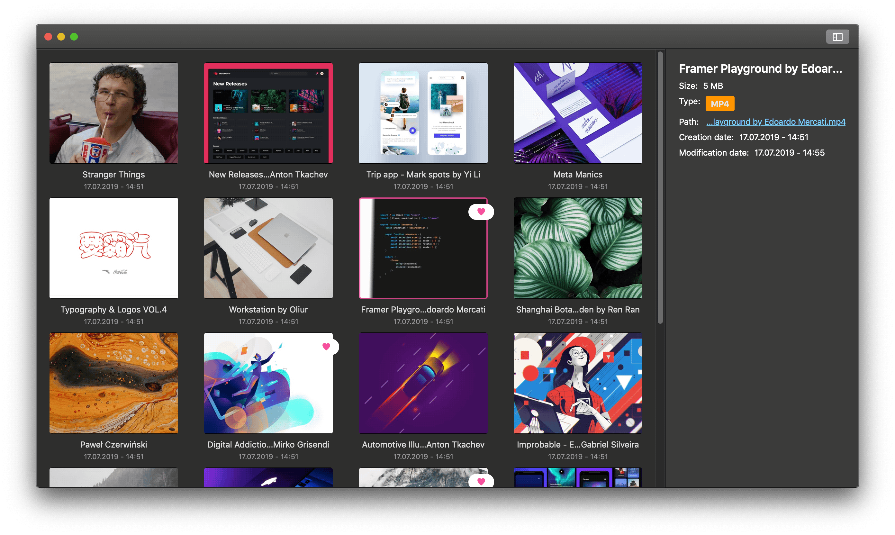

# imageOrg

native image and video organizer for macOS inspired by [Pixave](http://www.littlehj.com/mac/)

## Features

* Grid based gallery (see screenshot)
  * Sorting
    * by date added
    * by name
    * and by favorites
  * Multiple selection
  * Deletion
* Sidebar with detail information
  * toggleable
* Drag'n'drop importing of image and video files
* Detail view of images and videos
  * Renaming
  * Zooming
  * Favorites
  * Deletion
* Keyboard support
  * Gallery
    * Quick look for gallery items with *space*
    * Hit *return* on selected item to open the detail view
  * Detail
    * Press *backspace* to return to the gallery
    * Press *left* or *right arrow* to go back or forward
    * Press *d* to delete the item
    * Press *f* to favorite/unfavorite the item
  * Detail Video
    * Press *space* to start/pause the video